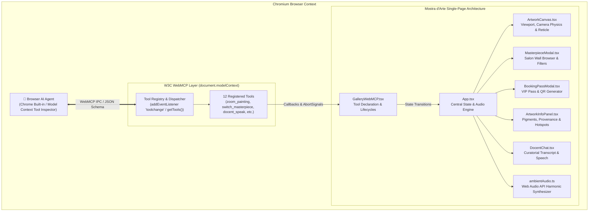

# 🏛️ Mostra d'Arte — System Architecture Specification

> **A Deep Technical Exploration of the Agent-Native WebMCP Art Gallery**  
> *Compliant with the W3C Web Machine Learning Working Group Draft & Chromium WebMCP Origin Trial.*

---

## 1. Executive Architectural Summary

Traditional web applications rely on human pointer interactions (clicking, scrolling, pinching) to traverse state. Conversely, traditional AI conversational interfaces operate in sandboxed chat widgets, isolated from the Document Object Model (DOM) and canvas rendering pipeline.

**Mostra d'Arte re-architects the relationship between AI and the browser.**  
By implementing the **W3C Web Model Context Protocol (WebMCP)**, the web application exposes a high-level, semantic, client-side API directly into `document.modelContext`. The AI agent (e.g. Chrome Built-in AI, Model Context Tool Inspector, or external LLM runner) acts as a physical **"Director of Attention"**, actuating camera physics, illumination shaders, spatial acoustics, curatorial archives, and transactional ticketing in real time.



---

## 2. Core Design Principles

### 2.1 Imperative Over Declarative WebMCP
While WebMCP supports declarative HTML attributes (`<form toolname="...">`), Mostra d'Arte intentionally adopts the **Imperative JavaScript API (`document.modelContext.registerTool`)**. This enables:
- Direct programmatic control over continuous 60fps spring camera animations.
- Real-time Web Audio API frequency modulation.
- Dynamic schema validation and structured JSON return objects.
- Bidirectional state synchronization with React 19 hooks.

### 2.2 Zero Duplication & Programmatic Tool Discovery
Rather than hardcoding tool lists in HTML, the application queries its own registered tools at runtime via `document.modelContext.getTools()`. The UI dynamically calculates badge telemetry, tool counts, and descriptions straight from the browser's registered memory.

### 2.3 Fail Gracefully and Enable Recovery (Google Architecture Standard)
Following Google Chrome Developer Relations guidelines authored by André Cipriani Bandarra:
- Tools never throw unhandled runtime exceptions (`throw new Error`).
- When provided with unrecognized identifiers (e.g. an unavailable artwork ID), tools return structured guidance listing all canonical alternatives.
- The agent self-corrects without interrupting the conversation or entering dead-end states.

### 2.4 Natural Language Variance Tolerance
Conversational queries exhibit natural variance. Mostra d'Arte absorbs this variance through:
- **Synonym normalization**: Mapping `"colors"` or `"pigments"` to `"palette"`; `"hotspots"` to `"focal"`.
- **Fuzzy period matching**: Resolving `"Dutch"` to `"Dutch Golden Age"`, and `"Renaissance"` to `"High Renaissance"`.
- **Defensive mathematical clamping**: Sanitizing coordinates with `Number.isFinite()` to prevent `NaN` viewport crashes.

### 2.5 Initial State Awareness & Contextual Binding
In alignment with Google's *"Define the Initial State"* methodology, tools maintain constant awareness of the active user viewport and exhibition environment (`currentArtworkRef.current`). When an agent queries `get_artwork_details({})` without arguments, it immediately receives provenance, dimensions, and focal coordinates of the artwork currently displayed on the canvas. Similarly, `start_guided_tour()` automatically launches for the currently exhibited painting, and `reserve_gallery_pass()` binds the active exhibition title to the visitor's digital pass. The agent never operates blind.

---

## 3. Subsystem Architecture

### 3.1 The WebMCP Bridge (`GalleryWebMCP.tsx`)
The bridge component is the primary interface between React state and the browser's Model Context engine.

- **Lifecycle Management**: Runs inside a `useEffect` hook tied to the lifetime of the gallery view. An `AbortController` instance manages cooperative cancellation across all registered tools.
- **Dynamic Registration**: Registers the complete 11-tool suite with parameter types, descriptions, and required constraints.
- **Event Listeners**: Attaches to `document.modelContext.addEventListener("toolchange")` to re-sync active tools whenever the browser model context environment updates.

```typescript
// Architectural pattern for cooperative cancellation and tool registration
const controller = new AbortController();

document.modelContext.registerTool({
  name: "zoom_painting",
  title: "Zoom Canvas on Detail",
  description: "Directs the gallery visitor's viewport and camera zoom to focus on a specific coordinate.",
  inputSchema: { ... },
  annotations: { readOnlyHint: true },
  execute: async ({ x, y, zoom, detail_name }, { signal } = {}) => {
    if (signal?.aborted) return "Operation cancelled.";
    // Safe mathematical sanitization
    const clampedX = Number.isFinite(Number(x)) ? Math.max(0, Math.min(100, Number(x))) : 50;
    const clampedY = Number.isFinite(Number(y)) ? Math.max(0, Math.min(100, Number(y))) : 50;
    const clampedZoom = Number.isFinite(Number(zoom)) ? Math.max(1, Math.min(8, Number(zoom))) : 2.5;

    onViewportChange({ x: clampedX, y: clampedY, zoom: clampedZoom, isAutoAnimating: true });
    return `Camera focused on "${detail_name || 'canvas detail'}" at {x: ${clampedX}%, y: ${clampedY}%} at ${clampedZoom}x zoom.`;
  }
}, { signal: controller.signal });
```

---

### 3.2 Canvas & Viewport Actuation Engine (`ArtworkCanvas.tsx`)
The viewport engine renders high-resolution master canvases with interactive spatial coordinates:

- **Coordinate System**: Normalized percentage space (`0%` to `100%` on both X and Y axes), with `{x: 50, y: 50}` representing geometric center.
- **Spring Camera Physics**: CSS transforms driven by `viewport.x`, `viewport.y`, and `viewport.zoom` with ease-out interpolation (`cubic-bezier(0.16, 1, 0.3, 1)`).
- **Golden Ratio & Composition Grid**: Analytical overlay toggled dynamically via `toggle_composition_grid` to analyze spiral proportions, focal intersections, and geometric harmonics.
- **Vignette Spotlight**: Radial mask shader dynamically focused on the active focal point, dimming outer boundaries for heightened curatorial focus.
- **Non-Passive Event Handlers**: Native `{ passive: false }` event bindings ensure smooth wheel zoom navigation without console warnings.

---

### 3.3 Curatorial Knowledge & Archives (`artworkData.ts`)
Static archival database containing canonical masterpieces across six major art movements:
- High Renaissance (Leonardo da Vinci, Michelangelo)
- Dutch Golden Age (Johannes Vermeer)
- Post-Impressionism (Vincent van Gogh)
- Early Renaissance (Sandro Botticelli)
- Japanese Edo Ukiyo-e (Katsushika Hokusai)
- Vienna Secession / Art Nouveau (Gustav Klimt)

Each masterpiece contains curated provenance, color palette harmonies with Hex codes and psychological symbolism, and microscopic focal point coordinates for agentic guidance.

---

### 3.4 Synthetic Ambient Acoustics Engine (`ambientAudio.ts`)
A dedicated procedural sound synthesizer built directly on the **Web Audio API**:
- **Harmonic Chord Structure**: Synthesizes a warm, low-register drone using resonant sine oscillators and bi-quad low-pass filters (cutoff at 400Hz).
- **Acoustic Convolver**: Models the reverberation and acoustic envelope of a stone museum gallery hall.
- **Dynamic Actuation**: Toggled via `toggle_ambient_acoustics({ active: true/false })` with smooth exponential gain ramps (`linearRampToValueAtTime`) to prevent audio popping.

---

### 3.5 Transactional VIP Booking System (`BookingPassModal.tsx`)
Demonstrating real-world service transactions executed via browser AI:
- **State Flow**: Invoked by `reserve_gallery_pass`.
- **Pass Verification**: Produces unique serial numbers (`MDA-2026-XXXX`), dates, session periods, and visitor badges.
- **Visual Presentation**: High-contrast golden luxury modal with SVG verification QR code, digital receipt styling, and confirmation sound.

### 3.6 Virtual Docent Agent Dialogue Projection (`DocentChat.tsx`)
Enabling seamless bidirectional agent-to-screen communication:
- **State Flow**: Invoked by `docent_speak({ message: "..." })`.
- **Dialogue Projection**: Renders the agent's natural language reasoning, insights, or curatorial commentary directly into the visitor's on-screen chat stream.
- **Speech Synthesis**: Synchronously triggers Web Speech API narration when voice mode is active.

---

## 4. Complete Tool Specification Matrix

| # | Tool Identifier | Intent & Domain | Read-Only Hint | Key Input Parameters | State Actuation Effect |
|:--|:---|:---|:---|:---|:---|
| **1** | `zoom_painting` | Spatial Navigation | `true` | `x`, `y`, `zoom`, `detail_name` | Adjusts camera transform & zooms onto detail |
| **2** | `switch_masterpiece` | Exhibition Switching | `true` | `artwork_id`, `reason` | Mounts new painting, resets camera, updates archives |
| **3** | `reset_view` | Spatial Reset | `true` | `note` | Smoothly animates camera back to 1.0x wide view |
| **4** | `toggle_spotlight` | Visual Lighting | `true` | `active` | Toggles vignette spotlight mask overlay |
| **5** | `get_artwork_details` | Archival Query | `true` | `artwork_id` | Returns provenance, palette, and focal coordinates |
| **6** | `start_guided_tour` | Autonomous Narration | `true` | `note` | Triggers sequential waypoint navigation and speech |
| **7** | `toggle_curatorial_dossier`| Research Drawer | `true` | `open`, `tab` | Slides out panel and selects specific tab |
| **8** | `toggle_ambient_acoustics` | Sensory Audio | `true` | `active` | Starts or mutes Web Audio API harmonic sound |
| **9** | `reserve_gallery_pass` | Transactional Action | `false` | `visitor_name`, `date`, `tickets_count`, `session` | Generates verified VIP admission ticket modal |
| **10**| `toggle_composition_grid` | Geometric Analysis | `true` | `active` | Overlays Golden Ratio & Rule of Thirds grid |
| **11**| `open_salon_browser` | Collection Filtration | `true` | `open`, `period`, `search` | Opens salon modal filtered by period or artist |
| **12**| `docent_speak` | Curatorial Projection | `true` | `message` | Projects agent commentary to on-screen Virtual Docent dialogue & voice |

---

## 5. Sequence Diagram: Multi-Tool Agentic Actuation

The following sequence illustrates the turn-by-turn collaboration between user, agent, WebMCP, and the React UI:

```mermaid
sequenceDiagram
    autonumber
    actor User as 👤 Visitor
    participant Agent as 🤖 Chrome AI Agent
    participant WebMCP as ⚡ W3C WebMCP (document.modelContext)
    participant AppState as ⚙️ App State (React 19)
    participant UI as 🖼️ Viewport & Audio Engines

    User->>Agent: "Analyze the composition of Starry Night and play ambient sound"

    rect rgb(24, 24, 27)
        Note over Agent,AppState: Step 1: Query Artwork Archival Data
        Agent->>WebMCP: get_artwork_details({ artwork_id: "starry-night" })
        WebMCP->>AppState: Read active masterpiece archives
        AppState-->>WebMCP: Details (Focal points, Cypress {16, 58}, Moon {88, 15})
        WebMCP-->>Agent: JSON curatorial payload
    end

    rect rgb(24, 24, 27)
        Note over Agent,UI: Step 2: Actuate Atmospheric Acoustics
        Agent->>WebMCP: toggle_ambient_acoustics({ active: true })
        WebMCP->>AppState: onToggleAmbient(true)
        AppState->>UI: ambientAudio.start()
        UI-->>WebMCP: Acoustics activated
        WebMCP-->>Agent: Confirmation string
    end

    rect rgb(24, 24, 27)
        Note over Agent,UI: Step 3: Overlay Golden Ratio Composition Grid
        Agent->>WebMCP: toggle_composition_grid({ active: true })
        WebMCP->>AppState: onViewportChange({ gridActive: true })
        AppState->>UI: Render SVG Golden Spiral & Thirds Grid
        UI-->>WebMCP: Grid activated
        WebMCP-->>Agent: Confirmation string
    end

    rect rgb(24, 24, 27)
        Note over Agent,UI: Step 4: Physical Glide to Impasto Brushwork
        Agent->>WebMCP: zoom_painting({ x: 16, y: 58, zoom: 3.2, detail_name: "Cypress Flame" })
        WebMCP->>AppState: onViewportChange({ x: 16, y: 58, zoom: 3.2 })
        AppState->>UI: Spring camera transforms canvas to (16%, 58%)
        UI-->>WebMCP: Camera focused on Cypress Flame
        WebMCP-->>Agent: Actuation confirmed
    end

    Agent->>User: "I've started the gallery acoustics, activated the composition grid, and zoomed into the cypress tree. Notice how its flame-like form anchors the left golden section..."
```



---

## 6. Security & Intent Declarations

In accordance with Google Chrome WebMCP Security Guidelines:
- **`readOnlyHint: true`**: Declared on 11 out of 12 tools. Signals that executions are safe and non-destructive, avoiding annoying confirmation popups.
- **Explicit Transactional Action**: `reserve_gallery_pass` omits `readOnlyHint` because it books a VIP admission pass and renders a ticket on screen.
- **Chrome Character Budgets**: All tool names (<30 chars), descriptions (<500 chars), and outputs (<1.5 KB) strictly follow Google's character budgets to prevent LLM context overflow.
- **Prompt Injection Defense**: All art facts and descriptions are vetted local museum archives, protecting the AI agent from malicious indirect prompt injections.
- **Local Client Boundary**: Everything runs 100% inside client memory with zero server telemetry or data tracking.

---

## 7. Standards Compliance & References

- **W3C Working Group Draft**: [Web Machine Learning Working Draft (WebMCP)](https://webmachinelearning.github.io/webmcp)
- **Chrome Status**: [Feature #5117755740913664](https://chromestatus.com/feature/5117755740913664)
- **Chromium Origin Trial**: ID `4163014905550602241`
- **Testing Flag**: `chrome://flags/#enable-webmcp-testing`
- **Chrome DevTools Debugger**: [Debug WebMCP tools in Chrome DevTools](https://developer.chrome.com/docs/devtools/application/webmcp)
- **Official Testing Extension**: [Model Context Tool Inspector](https://chromewebstore.google.com/detail/model-context-tool-inspec/gbpdfapgefenggkahomfgkhfehlcenpd)
